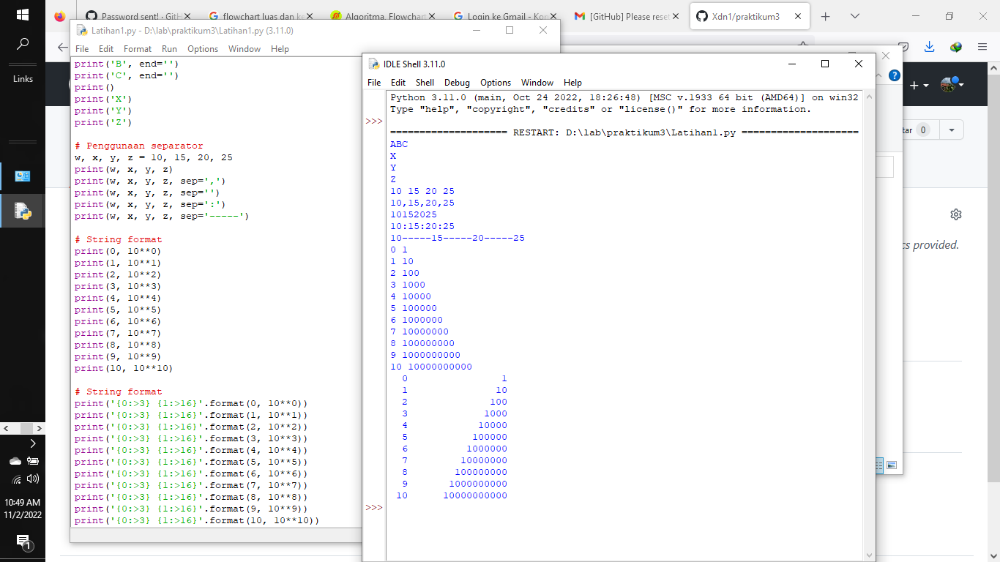
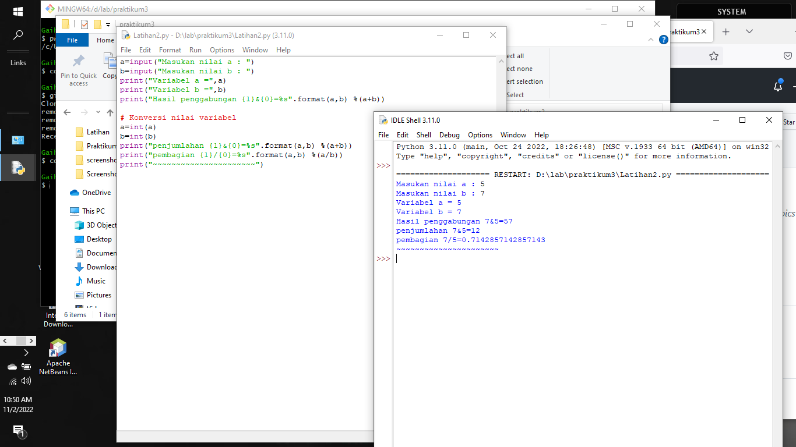
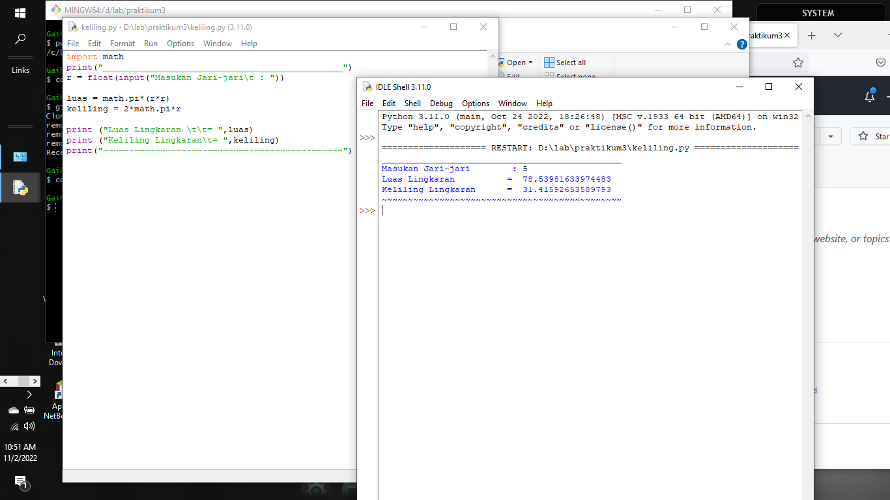
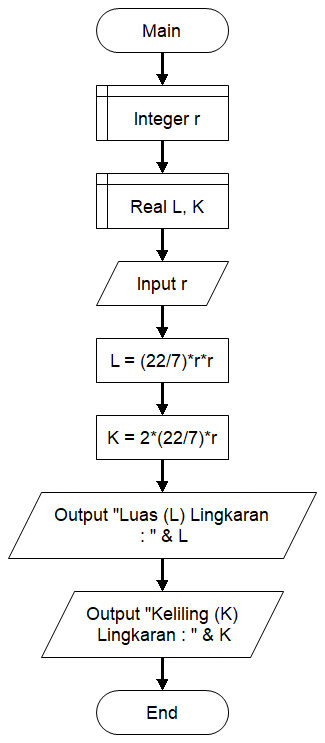

# Hasil dari Latihan 1

## Latihan 2
 Menjalankan IDLE
 Membuat file baru dengan nama latihan2.py (pastikan lokasi file
 pada folder praktikum3 pada direktori kerja anda).
 Menggunakan fungsi input untuk mengambil nilai variabel dari
 keyboard.
 # 1.input nilai variabel
 # 2.cetak nilai variabel
 # 3.cetak hasil operasi kedua variabel dengan string format
 # 4.konversi nilai variabel 
## FYI jika TypeError: %d format: a number is required, not str"
## Jika args adalah daftar atau tupel, %s dapat digunakan sebagai pengganti dalam kueri. Jika args adalah dict, %(name)s dapat digunakan sebagai placeholder dalam kueri

# Praktikum 3
# Luas dan Keliling Lingkaran
## Baris 1 : Memasukan Modul adalah sebuah file yang berisi sekumpulan fungsi–fungsi dan instruksi–instruksi program python, pemanggilan modul dijalankan dengan perintah import. Contoh modul yang kita butuhkan : import math.
## Baris 3 : Selanjutnya kita memerlukan nilai jari-jari (r) yang nantinya akan di masukan oleh pengguna pada layar console. Kita menggunakan fungsi input() yang nilainya di konversi ke tipe data float (bilangan riil).
## Baris 5 dan 6 : Ketika kita sudah mendapat nilai phi dan jari-jari selanjutnya kita bisa menghitung luas dan keliling sesuai dengan rumus-nya masing-masing.
## Baris 8 dan 9 : Selanjutnya kita tampilkan hasilnya dengan fungsi print(). sintak \t merupakan karakter espace yang berfungsi untuk membuat tab. dalam kasus ini agar sejajar karakter sama dengan (=) nya.

# Flowchart dari program menghitung luas dan keliling lingkaran

# Hasil dari Latihan 3

